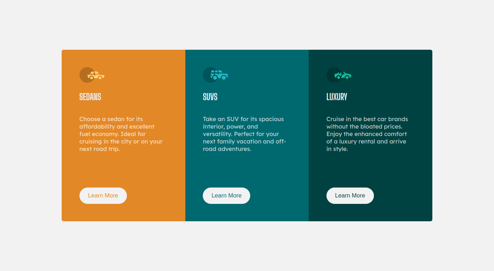

This is a solution to the [3-column preview card component challenge on Frontend Mentor](https://www.frontendmentor.io/challenges/3column-preview-card-component-pH92eAR2-). Frontend Mentor challenges help you improve your coding skills by building realistic projects. 

 - [The challenge](#the-challenge)
 - [Screenshot](#screenshot)

### The challenge

Users should be able to:

- View the optimal layout for the site depending on their device's screen size
- See hover states for all interactive elements on the page

### Screenshot

### Links

- Solution URL: [Github repo](https://github.com/julius-tamale/3-columnPreview)
- Live Site URL: [3 Column preview site](https://fm-3column-preview.netlify.app/)